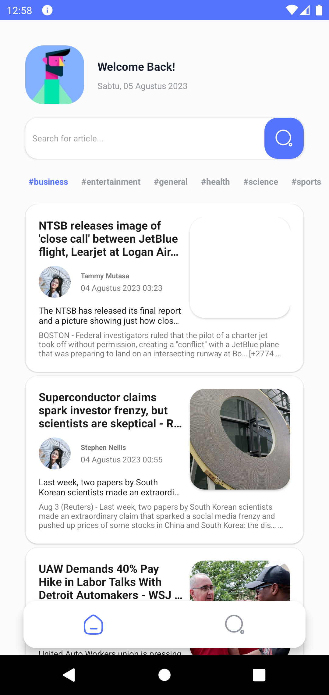
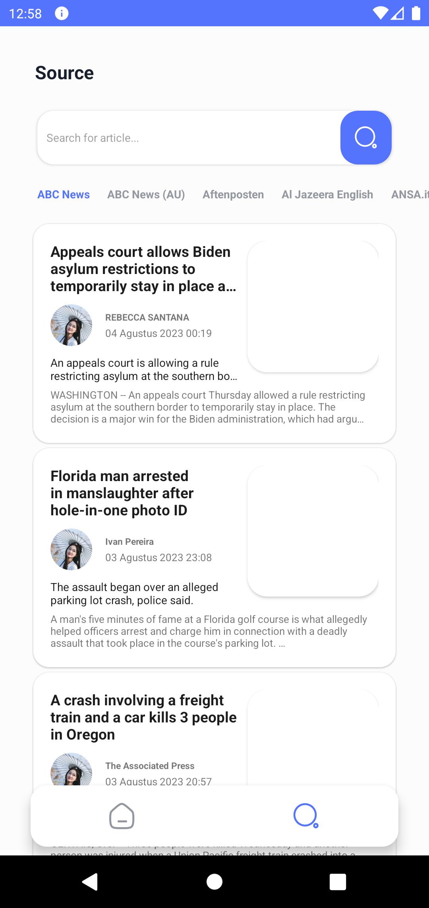

# NewsApp Android Sample

## About App
This application implements MVVM, clean architecture, and [NewsAPI](https://newsapi.org/) to retrieve diverse sources, each capable of supplying major headlines. [Retrofit 2](http://square.github.io/retrofit/) is employed to fetch news sources and headlines from the API, presenting them in a RecyclerView. The primary objective of this exemplary application is to demonstrate the development of a basic Android app using Kotlin.

## Installation:
- Go to [NewsAPI](https://newsapi.org/) and generate an API key
- Clone this repository
- Put the API key at the bottom of the `build.gradle` module level.

`
buildConfigField "String", "API_KEY", '"YOUR_API_KEY"'
`
- Run the app

## Architecture

--------------------

## Screenshots

  
  

--------------------

## Future Roadmap
- Offline functionality using Room & Diffutil
- Work Manager for login/signup & in-app Push notification
- Profile settings
- Support for Launguage, Country and Category selection
- ~~Write test cases~~

## MIT License

Copyright (c) 2023 Rizahan MIY

Permission is hereby granted, free of charge, to any person obtaining a copy
of this software and associated documentation files (the "Software"), to deal
in the Software without restriction, including without limitation the rights
to use, copy, modify, merge, publish, distribute, sublicense, and/or sell
copies of the Software, and to permit persons to whom the Software is
furnished to do so, subject to the following conditions:

The above copyright notice and this permission notice shall be included in all
copies or substantial portions of the Software.

THE SOFTWARE IS PROVIDED "AS IS", WITHOUT WARRANTY OF ANY KIND, EXPRESS OR
IMPLIED, INCLUDING BUT NOT LIMITED TO THE WARRANTIES OF MERCHANTABILITY,
FITNESS FOR A PARTICULAR PURPOSE AND NONINFRINGEMENT. IN NO EVENT SHALL THE
AUTHORS OR COPYRIGHT HOLDERS BE LIABLE FOR ANY CLAIM, DAMAGES OR OTHER
LIABILITY, WHETHER IN AN ACTION OF CONTRACT, TORT OR OTHERWISE, ARISING FROM,
OUT OF OR IN CONNECTION WITH THE SOFTWARE OR THE USE OR OTHER DEALINGS IN THE
SOFTWARE.
